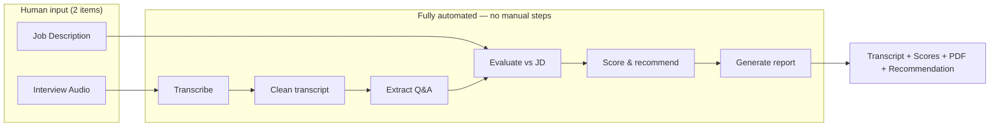
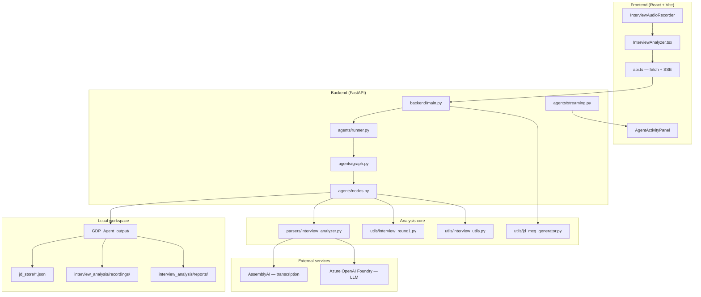
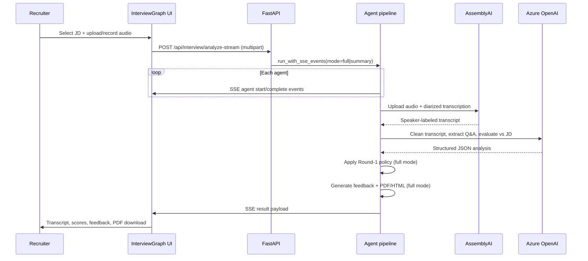
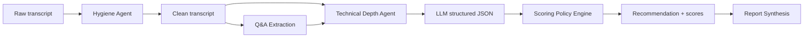
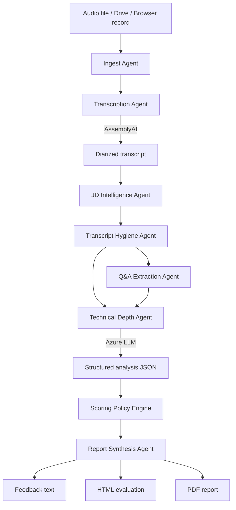

# InterviewGraph (GDP-Agent)

**Fully AI-automated, agentic interview analysis platform** — from raw audio to hiring recommendation with zero manual scoring. Transcribe interviews, evaluate candidates against job descriptions, and produce evidence-backed reports through an autonomous multi-agent pipeline.

Built for recruiters, hiring managers, and technical interviewers who need fast, consistent, JD-grounded feedback from recorded or live-captured interviews — without analysts manually reviewing transcripts or filling scorecards.

---

## Table of contents

- [Project overview](#project-overview)
- [Fully AI-automated pipeline](#fully-ai-automated-pipeline)
- [Objectives](#objectives)
- [System architecture](#system-architecture)
- [End-to-end workflow](#end-to-end-workflow)
- [Agentic AI architecture](#agentic-ai-architecture)
- [Module reference](#module-reference)
- [Technologies](#technologies)
- [Installation & setup](#installation--setup)
- [Running the application](#running-the-application)
- [Features & capabilities](#features--capabilities)
- [Live interview recording](#live-interview-recording)
- [Real-time analysis (SSE)](#real-time-analysis-sse)
- [Pre-recorded interview analysis](#pre-recorded-interview-analysis)
- [Candidate evaluation & scoring](#candidate-evaluation--scoring)
- [AI insights & reporting](#ai-insights--reporting)
- [Follow-up assessment](#follow-up-assessment)
- [API reference](#api-reference)
- [Project structure](#project-structure)
- [Workflow diagrams](#workflow-diagrams)
- [Demo script (events)](#demo-script-events)
- [Future roadmap](#future-roadmap)
- [License & attribution](#license--attribution)

---

## Project overview

InterviewGraph transforms raw interview audio into structured hiring intelligence through a **fully AI-automated pipeline**. Recruiters only provide two inputs — a job description and a recording — then click one button. Every downstream step (transcription, cleaning, Q&A mapping, skill evaluation, scoring, recommendation, feedback narrative, and PDF generation) runs autonomously via specialist AI agents.

The platform evolved from the HireEaze monolith into a focused **agentic interview analysis** product. Authentication, database persistence, and integrity monitoring were removed for simplicity; JD libraries and analysis artifacts are stored on the local filesystem under `GDP_Agent_output/`.

### What makes it agentic?

Each stage of the pipeline is a **specialist agent** with a single responsibility. Agents emit progress events over **Server-Sent Events (SSE)** so the UI shows live status. Orchestration uses **LangGraph** when installed, with an automatic sequential fallback when it is not.

---

## Fully AI-automated pipeline

InterviewGraph is designed as a **hands-free analysis engine**. Once the recruiter selects a JD and submits audio, the system runs end-to-end without human intervention — no manual transcript editing, no scorecard filling, no report writing.

### Human vs AI responsibilities

| Step | Who | Action |
|------|-----|--------|
| Provide job description | **Human** | Select saved JD or paste text once |
| Provide interview audio | **Human** | Upload file, Drive link, or browser record |
| Start analysis | **Human** | Single button click |
| Transcription & diarization | **AI** | AssemblyAI — automatic speaker labels |
| JD skill extraction | **AI** | LLM extracts mandatory/optional skills from JD text |
| Transcript hygiene | **AI** | LLM cleans ASR noise, assigns quality score |
| Q&A extraction | **AI** | Dedicated agent maps interviewer questions → candidate answers |
| Technical evaluation | **AI** | LLM evaluates every answer against JD rubric with evidence |
| Scoring & recommendation | **AI** | Policy engine computes weighted Round-1 scores + hire/no-hire band |
| Feedback narrative | **AI** | LLM generates recruiter-facing feedback aligned to canonical score |
| HTML evaluation + PDF report | **AI** | Auto-rendered structured report, saved to disk |
| Follow-up questions | **AI** | Generated from interview skills + uncovered JD gaps (optional step) |

**Result:** One click produces transcript, structured JSON scores, narrative feedback, HTML evaluation, and a downloadable PDF — fully automated.

### Automated pipeline flow



### What the AI automates in detail

#### 1. JD intelligence (automated)

- Paste any JD text → **Extract keywords** automatically extracts mandatory and optional technical skills via LLM
- Skills are stored in the JD library and reused for every future analysis against that role
- No manual rubric creation required

#### 2. Speech-to-text (automated)

- Audio uploaded to **AssemblyAI** automatically
- Speaker diarization labels **Interviewer (A)** vs **Candidate (B)**
- Transcript saved to workspace without manual export

#### 3. Transcript hygiene (automated)

- LLM removes filler words, ASR artifacts, and repeated phrases
- Produces a **quality score**, estimated question count, and truncation detection
- Downstream agents always work on cleaned text

#### 4. Q&A extraction (automated)

- Dedicated **Q&A Extraction Agent** runs a separate LLM call
- Filters out logistics, greetings, and small talk automatically
- Maps up to 12 structured question–answer pairs with per-answer ratings
- Regex fallback if LLM output is malformed

#### 5. Technical depth evaluation (automated)

- **Technical Depth Agent** runs a comprehensive evidence-only evaluation prompt covering:
  - Per-answer ratings (scenario, reasoning, problem-solving, communication)
  - Project authenticity gates (PATH A / PATH B)
  - JD skill coverage (mandatory vs optional)
  - Anti-hallucination rules — only transcript-verifiable claims
- No human reviewer needed to score individual answers

#### 6. Scoring policy (automated)

- **Scoring Policy Engine** (`utils/interview_round1.py`) deterministically recomputes:
  - Weighted overall rating across 9 dimensions
  - Recommendation band: **Selected** | **Strong Consider** | **On Hold** | **Rejected**
  - Next-round decision with evidence-based reason
- Prevents LLM score drift — server-side policy is the source of truth

#### 7. Report synthesis (automated)

- **Report Synthesis Agent** automatically generates:
  - Recruiter feedback narrative
  - Interactive HTML evaluation view
  - Professional PDF business report (ReportLab)
- Files saved under `GDP_Agent_output/interview_analysis/reports/` without manual export

#### 8. Follow-up intelligence (automated, optional)

- After analysis, **Generate follow-up questions** produces 5 targeted verbal questions
- 70% drawn from skills demonstrated in the interview; 30% from uncovered JD mandatory skills
- Skills gap tags (covered / mandatory gap / optional gap) computed automatically

### Automation modes

| Mode | Agents | Automated output | Typical time |
|------|--------|------------------|--------------|
| **Summary** | 4 agents | Transcript + recruiter summary | Fast (~minutes) |
| **Full analysis** | 8 agents | Transcript + scores + feedback + HTML + PDF | Full (~5–15 min by audio length) |

Both modes are **100% automated** after the single start button. The summary path skips Round-1 scoring and PDF for speed; the full path runs the complete evaluation stack.

### Real-time automation visibility

During automated processing, the **Multi-Agent Pipeline** panel streams live SSE events — each agent transitions from pending → running → complete. Recruiters see exactly which AI step is executing without polling or page refresh.

```
[Ingest Agent          ] ✓ Complete
[Transcription Agent   ] ✓ Complete  — AssemblyAI speaker diarization
[JD Intelligence Agent ] ✓ Complete  — Skill rubric loaded
[Transcript Hygiene    ] ● Running   — Cleaning ASR output...
[Q&A Extraction Agent  ] ○ Pending
[Technical Depth Agent ] ○ Pending
[Scoring Policy Engine ] ○ Pending
[Report Synthesis Agent] ○ Pending
```

---

## Objectives

| Goal | How InterviewGraph delivers |
|------|----------------------------|
| **Full automation** | One click: audio + JD → transcript, scores, recommendation, PDF — zero manual analysis |
| **Speed** | Summary path: transcript + recruiter summary in minutes |
| **Consistency** | Deterministic Round-1 policy layer recomputes scores and recommendations after LLM output |
| **Evidence** | Dedicated Q&A extraction agent maps questions to answers for auditability |
| **JD alignment** | Mandatory/optional skills extracted from JD drive evaluation rubric |
| **Recruiter UX** | Simple 3-step UI: pick JD → provide recording → review AI-generated results |
| **Demo-ready** | Real SSE agent panel, auto PDF reports, AI follow-up question generation |

---

## System architecture



### Layer responsibilities

| Layer | Role |
|-------|------|
| **Frontend** | JD management UI, file upload, browser recording, agent progress, results tabs, PDF download |
| **API** | REST + SSE endpoints, validation, Google Drive ingestion, JD CRUD |
| **Agent orchestration** | LangGraph state machine or sequential fallback; event emission |
| **Interview analyzer** | AssemblyAI upload/transcribe, LLM prompts, JSON parsing |
| **Round-1 policy** | Weighted scoring, recommendation bands, rescue floors |
| **Report utils** | PDF (ReportLab) and HTML evaluation rendering |
| **Workspace** | File-backed JD store and per-session artifact directories |

---

## End-to-end workflow



### User journey (3 steps)

1. **Job description** — Select a saved JD from the library, or paste new JD text → extract keywords → save to library.
2. **Recording & analysis** — Upload a file, paste a Google Drive link, or record live in Chrome (tab + mic). Choose *Transcript + summary* or *Full analysis (PDF)*.
3. **Results** — Review transcript, summary or full evaluation, download PDF, optionally generate follow-up questions.

---

## Agentic AI architecture

InterviewGraph's agentic layer is the **automation backbone** — each agent owns one step of the fully automated pipeline. Agents chain together via LangGraph (or sequential fallback) with no human checkpoints between them.

### Full analysis pipeline (8 agents)

Used when **Full analysis (PDF)** is selected or Google Drive is the source.

| Agent ID | Display name | Responsibility |
|----------|--------------|----------------|
| `ingest` | Ingest Agent | Validates input; persists raw audio under `recordings/{date}/{source}/` |
| `transcription` | Transcription Agent | AssemblyAI upload + speaker diarization; saves transcript |
| `jd` | JD Intelligence Agent | Loads mandatory/optional skills from JD store or inline keywords |
| `hygiene` | Transcript Hygiene Agent | LLM cleans ASR artifacts; returns quality score and metadata |
| `qa` | Q&A Extraction Agent | Dedicated LLM call extracts up to 12 Q&A pairs (regex fallback) |
| `technical` | Technical Depth Agent | Full JD evaluation via structured LLM JSON prompt |
| `policy` | Scoring Policy Engine | Parses JSON; attaches Q&A and multi-JD data; applies Round-1 rules |
| `synthesis` | Report Synthesis Agent | Feedback narrative + HTML evaluation + auto PDF to reports dir |

### Summary pipeline (4 agents)

Used for **Transcript + summary** on upload or browser record (fast path).

| Agent ID | Display name | Responsibility |
|----------|--------------|----------------|
| `ingest` | Ingest Agent | Same as full pipeline |
| `transcription` | Transcription Agent | Same as full pipeline |
| `jd` | JD Intelligence Agent | Aligns summary context with JD skills |
| `summary` | Summary Agent | Generates recruiter-facing plain-text summary sections |

### Orchestration implementation

```
backend/agents/
├── state.py      # InterviewState TypedDict (shared graph state)
├── nodes.py      # Node functions + PipelineContext
├── graph.py      # LangGraph StateGraph builders + sequential fallback
├── runner.py     # run_full_analysis, run_summary_analysis, run_with_sse_events
├── streaming.py  # Async SSE generator (ThreadPoolExecutor + queue)
├── events.py     # AgentEvent, ResultEvent, ErrorEvent, DoneEvent
└── qa_agent.py   # extract_qa_pairs() — isolated Q&A LLM call
```

LangGraph is **recommended** but optional. If `langgraph` is not installed, `invoke_graph()` runs the same nodes in order via `run_sequential()`.

---

## Module reference

### Backend (`backend/`)

| File | Purpose |
|------|---------|
| `main.py` | FastAPI app, all `/api/*` routes, Google Drive download, CORS |
| `user_workspace.py` | `AppWorkspace` — paths under `GDP_Agent_output/` |
| `interview_jd.py` | `build_jd_evaluation_entries()` — resolves JD by stem, name, or inline keywords |
| `env_config.py` | Environment loading helpers |
| `frontend_static.py` | Serves `frontend/dist` SPA in production |
| `api_error_handlers.py` | Global exception handlers |
| `azure_llm.py` | Azure OpenAI Foundry LLM wrapper |

### Parsers (`parsers/`)

| File | Purpose |
|------|---------|
| `interview_analyzer.py` | Core `InterviewAnalyzer` class (~2000 lines): AssemblyAI, LLM prompts, JSON parsing, multi-JD evaluation, summary generation |

Key methods:

- `upload_file()` / `request_transcription_with_speakers()` — audio → diarized transcript
- `extract_technical_keywords_from_jd()` — mandatory/optional skills JSON
- `assess_and_clean_transcript()` — ASR hygiene + quality score
- `analyze_transcript_with_gemini()` — main Round-1 evaluation prompt
- `generate_feedback_from_analysis_llm()` — narrative feedback aligned to recommendation
- `generate_interview_summary_from_transcript()` — summary-only path
- `parse_analysis_json()` — sanitize and parse LLM JSON output

### Utils (`utils/`)

| File | Purpose |
|------|---------|
| `interview_utils.py` | `InterviewUtils` — PDF reports (ReportLab) and HTML evaluation rendering |
| `interview_round1.py` | Deterministic Round-1 scoring, weighted sub-ratings, recommendation bands |
| `jd_mcq_generator.py` | `generate_summary_followup_questions()` — 5 follow-up Qs + skills gap analysis |
| `json_sanitizer.py` | LLM JSON cleanup |
| `hireeaze_logging.py` | Structured logging for API and interview flows |

### Frontend (`frontend/src/`)

| Path | Purpose |
|------|---------|
| `pages/InterviewAnalyzer.tsx` | Main application page — JD, recording, analysis, results, follow-up |
| `components/InterviewAudioRecorder.tsx` | Chrome tab + mic mixed recording |
| `components/AgentActivityPanel.tsx` | Live SSE-driven agent status UI |
| `components/AppLayout.tsx` | Header shell with InterviewGraph branding |
| `components/ui/` | Design system (Button, FileDropzone, Toast, etc.) |
| `api.ts` | HTTP client + `apiFormPostStream()` SSE parser |
| `styles/interview-graph.css` | Studio UI layout and CSS animations |

Legacy pages (`ResumeParser.tsx`, `JdMatcher.tsx`, etc.) remain in the repo from the HireEaze fork but are **not routed** in the current app (`App.tsx` only mounts `/interview`).

---

## Technologies

### Backend

| Technology | Use |
|------------|-----|
| **Python 3.10+** | Runtime |
| **FastAPI** | REST API + SSE streaming |
| **Uvicorn** | ASGI server |
| **LangGraph** | Agent orchestration (optional) |
| **LangChain Core** | Graph utilities |
| **AssemblyAI** | Speech-to-text with speaker labels |
| **Azure OpenAI Foundry** | LLM for evaluation, cleaning, Q&A, summaries |
| **ReportLab** | PDF report generation |
| **Pydantic** | Request/response models |
| **python-dotenv** | Environment configuration |

### Frontend

| Technology | Use |
|------------|-----|
| **React 18** | UI framework |
| **TypeScript** | Type safety |
| **Vite 5** | Dev server and production build |
| **React Router 6** | Client routing |
| **Tailwind CSS + Radix UI** | Component styling and primitives |
| **Lucide React** | Icons |

### DevOps & tooling

| Tool | Use |
|------|-----|
| **npm / concurrently** | Run API + UI together (`npm run dev`) |
| **wait-on** | Health-check gate before starting Vite |
| **ffmpeg** | Audio processing (system dependency) |

---

## Installation & setup

### Prerequisites

- **Node.js 18+**
- **Python 3.10+**
- **npm**
- API keys: AssemblyAI + Azure OpenAI Foundry (see [Environment variables](#environment-variables))
- Optional system tools: `ffmpeg`, `tesseract`, `poppler-utils` (for extended document features)

### Quick setup

```bash
git clone <your-repo-url>
cd GDP-Agent

# One-time bootstrap: venv, pip install, npm install, .env template
npm run setup

# Edit .env and add your API keys
cp .env.example .env   # if not already created by setup
# nano .env

# Install LangGraph (recommended for agent orchestration)
source .venv/bin/activate
pip install langgraph langchain-core

# Start development servers
npm run dev
```

### Environment variables

Create `.env` at the project root (never commit this file):

```env
# Required for interview analysis
ASSEMBLYAI_API_KEY=your_assemblyai_key
AZURE_FOUNDRY_ENDPOINT=https://your-resource.openai.azure.com/
AZURE_FOUNDRY_KEY=your_azure_key
AZURE_DEPLOYMENT_NAME=your_deployment_name
AZURE_OPENAI_API_VERSION=2024-10-21
```

Optional tuning — Round-1 scoring weights (must sum sensibly; renormalized automatically):

```env
ROUND1_WEIGHT_SCENARIO=0.22
ROUND1_WEIGHT_REASONING=0.18
ROUND1_WEIGHT_PROBLEM_SOLVING=0.18
ROUND1_WEIGHT_COMMUNICATION=0.12
ROUND1_WEIGHT_TECH_QA=0.08
ROUND1_WEIGHT_EXPLANATION=0.06
ROUND1_WEIGHT_PROJECT=0.06
ROUND1_WEIGHT_WORK_EXPLANATION=0.06
ROUND1_WEIGHT_INTEGRITY=0.04
```

### Demo JD

A sample job description is included:

```
GDP_Agent_output/jd_store/Senior_ML_Engineer_Demo.json
```

Select it in Step 1 of the UI for event demos.

---

## Running the application

### Development (recommended)

```bash
npm run dev
```

| Service | URL |
|---------|-----|
| **UI** | http://127.0.0.1:5173/interview |
| **API health** | http://127.0.0.1:8004/api/health |
| **API docs** | http://127.0.0.1:8004/docs |

The dev script starts uvicorn (port **8004**, hot reload on `backend/`, `utils/`, `parsers/`) and Vite (port **5173**) concurrently. Vite proxies `/api` to the backend.

For LAN or ngrok demos:

```bash
npm run dev:public --prefix frontend
```

### Production (single server)

```bash
npm run build          # builds frontend → frontend/dist
npm run start:prod     # uvicorn serves API + static SPA on :8004
```

Open http://127.0.0.1:8004/interview

### Manual backend only

```bash
source .venv/bin/activate
uvicorn backend.main:app --host 0.0.0.0 --port 8004 --reload
```

---

## Features & capabilities

| Feature | Description |
|---------|-------------|
| **Fully AI-automated pipeline** | End-to-end: audio → transcript → scores → recommendation → PDF with no manual steps |
| **JD library** | Create, read, update, delete job descriptions; AI keyword extraction from pasted text |
| **File upload analysis** | MP4, M4A, MP3, WAV, WEBM from Zoom, Meet, Teams |
| **Google Drive ingestion** | Full automated analysis from a shared Drive file link |
| **Browser recording** | Chrome tab audio + microphone mixed capture → same automated pipeline |
| **Summary mode** | Fast automated transcript + AI recruiter summary |
| **Full analysis mode** | Automated Round-1 scores, feedback, HTML evaluation, PDF report |
| **Live agent panel** | Real-time SSE progress as each AI agent completes its step |
| **Q&A evidence map** | AI-extracted question–answer pairs in analysis JSON |
| **Follow-up questions** | AI-generated verbal follow-up Qs based on interview + JD gaps |
| **Follow-up recording** | Save candidate answer audio + metadata |
| **PDF export** | Auto-generated and on-demand business report |

---

## Live interview recording

InterviewGraph supports **in-browser capture** for remote interviews conducted in Chrome.

### How it works

The `InterviewAudioRecorder` component:

1. Requests **display media** — recruiter shares the **Chrome tab** running Zoom / Meet / Teams (with tab audio).
2. Requests **microphone** — with echo cancellation and noise suppression.
3. Mixes both streams via `AudioContext` (tab gain ×2, mic gain ×1).
4. Records mixed output as **WebM/Opus** (fallback: M4A/OGG).
5. Passes the resulting `File` to the same upload pipeline as a pre-recorded file.

### Best practices

| Scenario | Recommended approach |
|----------|---------------------|
| **Remote interview (Zoom/Meet/Teams)** | Platform **Record** → download MP4/M4A → **Upload file** (most reliable) |
| **Live capture in Chrome** | **Record** tab + mic in InterviewGraph |
| **In-person interview** | Browser **Record** with microphone only |

See also: [`docs/INTERVIEW_RECORDING.md`](docs/INTERVIEW_RECORDING.md)

---

## Real-time analysis (SSE)

Upload and browser-record paths use **Server-Sent Events** so recruiters watch the **fully automated pipeline** execute in real time — each agent starts and completes without user intervention.

### Endpoints

| Endpoint | Mode | Agents |
|----------|------|--------|
| `POST /api/interview/analyze-stream` | `full` | 8 agents → PDF + HTML |
| `POST /api/interview/process-recording-stream` | `summary` | 4 agents → transcript + summary |

### Event types

```json
{ "type": "agent", "id": "transcription", "label": "Transcription Agent", "phase": "start" }
{ "type": "agent", "id": "transcription", "phase": "complete", "message": "..." }
{ "type": "result", "payload": { "transcript": "...", "parsed_data": { ... } } }
{ "type": "error", "message": "..." }
{ "type": "done" }
```

The frontend (`apiFormPostStream` in `api.ts`) parses SSE over a `fetch` readable stream (multipart POST, not `EventSource`). `AgentActivityPanel` maps agent IDs to pending / running / complete / error states with CSS animations.

Google Drive analysis uses the synchronous `POST /api/interview/analyze` endpoint (no SSE) because there is no file upload from the client.

---

## Pre-recorded interview analysis

All pre-recorded paths (upload, Google Drive) trigger the same **fully AI-automated** agent pipeline. The recruiter does not transcribe, score, or write reports manually.

### Upload file (recommended)

1. Select or create a JD.
2. Choose **Upload** tab.
3. Drop meeting recording (MP4, M4A, MP3, WAV, WEBM).
4. Select output mode:
   - **Transcript + summary** — fast path via summary pipeline
   - **Full analysis (PDF)** — complete Round-1 evaluation
5. Click **Generate transcript & summary** or **Start full agent analysis**.

### Google Drive link

1. Share recording as **Anyone with the link (Viewer)**.
2. Paste the Drive file URL.
3. Runs **full analysis** pipeline (Drive path always uses full mode).

### Artifacts saved per session

```
GDP_Agent_output/interview_analysis/
├── recordings/{YYYY-MM-DD}/{source_name}/
│   ├── {source}_{HHMMSS}.webm          # raw audio
│   ├── {source}_{HHMMSS}_transcript.txt
│   ├── {source}_{HHMMSS}_Report.pdf    # full mode
│   └── {source}_{HHMMSS}_summary.txt   # summary mode
├── transcripts/{source_name}.txt
└── reports/{source}_{HHMMSS}_Report.pdf
```

---

## Candidate evaluation & scoring

InterviewGraph evaluates candidates **from interview transcripts**, not from resume uploads in the current release. Evaluation is always **JD-grounded**: mandatory and optional skills extracted from the job description form the rubric.

### Evaluation flow



### Round-1 scoring dimensions

The **Scoring Policy Engine** (`utils/interview_round1.py`) applies deterministic rules after the LLM returns JSON:

| Dimension | Default weight | What it measures |
|-----------|---------------|------------------|
| Scenario Q&A | 22% | Situational / case-study answers |
| Reasoning | 18% | Logical depth and clarity |
| Problem solving | 18% | Approach to technical challenges |
| Communication | 12% | Articulation and structure |
| Technical Q&A | 8% | Direct technical question performance |
| Explanation | 6% | Ability to explain concepts |
| Project explanation | 6% | Portfolio / project authenticity |
| Work explanation | 6% | Experience narrative |
| Answer integrity | 4% | Consistency and honesty signals |

### Recommendation bands

| Recommendation | Meaning |
|----------------|---------|
| **Selected** | Strong fit; advance to next round |
| **Strong Consider** | Good fit with minor gaps |
| **On Hold** | Mixed signals; needs follow-up |
| **Rejected** | Does not meet Round-1 bar |

The policy layer includes **scenario rescue floors** — candidates with strong scenario performance are not automatically capped by weak portfolio signals alone.

### Resume analysis (legacy note)

The codebase includes **legacy HireEaze resume parsing** utilities (`config.py`, `ResumeParser.tsx`, document libraries in `requirements.txt`). These are **not exposed** by the current FastAPI backend (`backend/main.py` has no `/api/parse/*` routes). The active product evaluates candidates through **interview audio analysis**. Resume-to-JD matching is planned for a future release (see [Roadmap](#future-roadmap)).

---

## AI insights & reporting

### Structured analysis JSON (`parsed_data`)

The Technical Depth Agent produces rich JSON including:

- Candidate profile and experience summary
- Per-skill ratings against JD mandatory/optional lists
- Technical Q&A table with per-answer ratings
- Project authenticity assessment
- Scenario responses
- Overall rating and recommendation

### Feedback narrative

The Report Synthesis Agent generates human-readable feedback aligned to the **canonical recommendation** from the policy engine (prevents LLM/policy drift).

### HTML evaluation view

`InterviewUtils.render_advanced_evaluation_html()` renders an interactive-style evaluation page shown in the UI **Evaluation** tab — expertise breakdown, metrics, Q&A blocks, and recommendation summary.

### PDF business report

`InterviewUtils.build_full_structured_pdf_business()` generates a **clean, simple A4 PDF** with all evaluation details in numbered sections:

1. **Executive summary** — recommendation, next-round decision, all Round-1 scores
2. **Candidate profile** — name, experience, education, technologies
3. **JD skill evaluation** — per-skill ratings and summaries
4. **Technical maturity** — discussion and explanation assessment
5. **Projects & authenticity** — business problem, approach, authenticity, maturity
6. **Technical Q&A** — full questions, answers, ratings, and evaluator notes
7. **Concept questions summary** — condensed concept table
8. **Gaps & follow-up questions** — missing/shallow topics and recommended Qs
9. **Final feedback** — AI-generated narrative sections
10. **Multi-JD evaluation** — when multiple JDs are evaluated

Download via UI or `POST /api/interview/build-pdf`.

### Summary mode output

Plain-text sections:

- Overview
- Technical highlights
- Gaps and concerns
- JD alignment
- Recommendation

---

## Follow-up assessment

After analysis completes, recruiters can optionally:

1. **Generate follow-up questions** — `POST /api/interview/generate-summary-questions`
   - 5 open-ended verbal questions (~70% from skills demonstrated in interview, ~30% from uncovered JD mandatory skills)
   - Skills coverage tags (covered, mandatory gaps, optional gaps)
2. **Record candidate answers** — browser microphone; save via `POST /api/interview/save-followup-recording`
   - Audio stored under `interview_analysis/followup_recordings/`
   - Optional questions JSON metadata alongside

Follow-up answer **transcription and scoring** is not yet automated (roadmap item).

---

## API reference

### Health

| Method | Path | Description |
|--------|------|-------------|
| `GET` | `/api/health` | `{ "status": "ok" }` |
| `HEAD` | `/api/health` | Liveness probe |

### JD store

| Method | Path | Description |
|--------|------|-------------|
| `GET` | `/api/jd-store` | List saved JDs |
| `GET` | `/api/jd-store/{stem}` | Get one JD |
| `POST` | `/api/jd-store` | Create JD |
| `PUT` | `/api/jd-store/{stem}` | Update JD |
| `DELETE` | `/api/jd-store/{stem}` | Delete JD |
| `POST` | `/api/jd-store/{stem}/rename` | Rename JD |
| `POST` | `/api/jd-store/extract-keywords` | Extract skills from JD text |

### Interview analysis

| Method | Path | Description |
|--------|------|-------------|
| `POST` | `/api/interview/analyze` | Full analysis (upload or Drive), JSON response |
| `POST` | `/api/interview/analyze-stream` | Full analysis with SSE agent events |
| `POST` | `/api/interview/process-recording` | Summary pipeline, JSON response |
| `POST` | `/api/interview/process-recording-stream` | Summary pipeline with SSE |
| `POST` | `/api/interview/build-pdf` | Build PDF from analysis JSON |
| `POST` | `/api/interview/generate-summary-questions` | Follow-up question generation |
| `POST` | `/api/interview/save-followup-recording` | Save follow-up answer audio |

Interactive OpenAPI docs: http://127.0.0.1:8004/docs

---

## Project structure

```
GDP-Agent/
├── backend/                 # FastAPI server + agent orchestration
│   ├── main.py              # API routes
│   ├── agents/              # LangGraph pipeline
│   └── user_workspace.py    # File workspace paths
├── frontend/                # React + Vite UI
│   └── src/
│       ├── pages/InterviewAnalyzer.tsx
│       ├── components/
│       └── api.ts
├── parsers/
│   └── interview_analyzer.py
├── utils/
│   ├── interview_utils.py   # PDF + HTML reports
│   ├── interview_round1.py  # Scoring policy
│   └── jd_mcq_generator.py  # Follow-up questions
├── GDP_Agent_output/        # Runtime data (gitignored)
│   └── jd_store/            # Saved job descriptions
├── docs/
│   └── INTERVIEW_RECORDING.md
├── scripts/
│   ├── bootstrap.sh         # npm run setup
│   └── start.sh
├── requirements.txt
├── package.json
├── .env.example
└── README.md
```

---

## Workflow diagrams

### UI flow

```
┌─────────────────────────────────────────────────────────────┐
│  InterviewGraph Header                                      │
├─────────────────────────────────────────────────────────────┤
│  Hero: Agentic Interview Analysis                           │
├─────────────────────────────────────────────────────────────┤
│  [Multi-Agent Pipeline Panel]  ← live during analysis       │
├─────────────────────────────────────────────────────────────┤
│  Step 1: Job Description                                    │
│    └─ Select saved JD / view keywords                       │
├─────────────────────────────────────────────────────────────┤
│  ▶ Create JD from text (optional, collapsible)              │
├─────────────────────────────────────────────────────────────┤
│  Step 2: Recording & Analysis                               │
│    [Upload] [Drive link] [Record]                           │
│    Output: [Transcript+summary] [Full analysis PDF]         │
│    [ Start agent analysis ]                                 │
├─────────────────────────────────────────────────────────────┤
│  Results: Transcript | Summary | Feedback | PDF             │
├─────────────────────────────────────────────────────────────┤
│  ▶ Follow-up assessment (optional, collapsible)             │
└─────────────────────────────────────────────────────────────┘
```

### Data flow (full analysis)



> **Screenshots:** Add UI screenshots to `docs/screenshots/` and embed them here before your event demo, e.g. ``.

---

## Demo script (events)

**90-second walkthrough for judges and organizers:**

1. Open **http://127.0.0.1:5173/interview** — show InterviewGraph branding and 3-step layout.
2. **Step 1:** Select `Senior_ML_Engineer_Demo` from the JD dropdown; briefly show AI-extracted keywords.
3. **Step 2:** Upload a short meeting recording (or use Browser Record in Chrome).
4. Click **one button** — emphasize **zero manual analysis** from this point forward.
5. Watch the **Multi-Agent Pipeline** panel progress through real SSE events (8 agents, fully automated).
6. **Results:** Show AI-generated transcript → scores → recommendation → download PDF.
7. *(Optional)* Expand **Follow-up assessment** → AI generates 5 targeted questions automatically.

**Talking points:**

- **Fully AI-automated** — recruiter provides JD + audio; everything else is autonomous
- 8 specialist agents, not one monolithic prompt
- Evidence-backed Q&A extraction with anti-hallucination rules
- Deterministic scoring policy on top of LLM output (server is source of truth)
- JD-grounded evaluation, not generic summaries
- One click → hire/no-hire recommendation + professional PDF report

---

## Future roadmap

| Priority | Enhancement |
|----------|-------------|
| **High** | Fully automated follow-up answer transcription and scoring (extend automation to Step 4) |
| **High** | Resume parsing API re-integration (PDF/DOCX → structured profile → automated JD match) |
| **High** | Parallel LangGraph branches (hygiene + Q&A + technical overlap for faster automation) |
| **Medium** | Live transcript streaming during browser record (real-time partial automation) |
| **Medium** | Multi-candidate comparison dashboard |
| **Medium** | MCQ + subjective assessment module (utilities exist in `jd_mcq_generator.py`) |
| **Medium** | Cloud storage backends (S3/GCS) instead of local filesystem |
| **Low** | Auth and multi-tenant workspace isolation |
| **Low** | Database persistence for JD library and audit trail |
| **Low** | Custom scoring weight presets per role family |

---

## Troubleshooting

| Issue | Fix |
|-------|-----|
| `503` — API keys missing | Ensure `.env` has all four required keys; restart uvicorn from project root |
| `vite: not found` | Run `npm install --prefix frontend` from project root |
| Port 8004 in use | `npm run free-api-port` |
| LangGraph import error | `pip install langgraph langchain-core` (or use built-in sequential fallback) |
| No tab audio in Chrome | Share the meeting **tab**, not window; enable **Share tab audio** |
| Empty JD list | Create a JD in the collapsible section or copy demo JSON to `GDP_Agent_output/jd_store/` |

---

## License & attribution

InterviewGraph (GDP-Agent) is derived from the **HireEaze** interview analysis module, refactored into an agentic architecture for standalone deployment.

For event submission, ensure `.env` and `GDP_Agent_output/` are **not** committed (already listed in `.gitignore`).

---

**Questions?** Open an issue or refer to the interactive API docs at `/docs` when the server is running.
